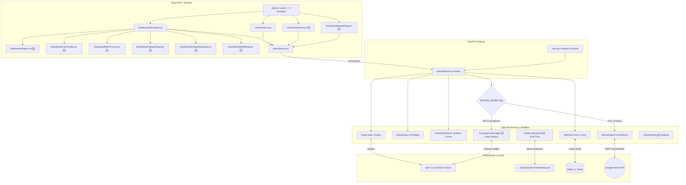

# 🛡️ DOCUMENTO DE TRASPASO (HANDOFF.md)
## Plataforma Híbrida Antifraude — Aseguradora del Sur v2.0.0

> **Última actualización**: 2026-05-29 · Sesión: Enriquecimiento de Evidencias y Alertas Robustas (v2.0.0)

Este documento contiene la especificación técnica completa del estado actual de la plataforma de detección de fraudes de Aseguradora del Sur. Está diseñado para que cualquier ingeniero, científico de datos o agente de IA pueda retomar el desarrollo en una nueva sesión de forma inmediata.

---

## 🗺️ Mapa de Arquitectura y Flujo de Datos

El sistema está construido bajo principios de **Clean Architecture** (Arquitectura Limpia) en el Backend y una **SPA Modular en React** con in-browser transpilación (Babel Standalone) para el Frontend.

### Diagrama de Componentes (Mermaid)



### Árbol de Directorios del Repositorio

```
HACKATON_FINAL/
├── api/
│   ├── __init__.py           # Inicialización de la API
│   └── endpoints.py          # Enrutamiento (POST /analyze, POST /chat, POST /claims/create, GET /claims/catalogs)
├── core/
│   ├── __init__.py           # Inicialización de Core
│   └── config.py             # Configuración Pydantic Settings & Validador de Pool
├── schemas/
│   ├── __init__.py           # Inicialización de Schemas
│   └── contracts.py          # Contratos tipados Pydantic V2 y Enums
├── services/
│   ├── __init__.py              # Inicialización de Servicios
│   ├── anomaly_detector.py      # Isolation Forest y Grafos (Scikit-Learn)
│   ├── claim_registry.py        # 🆕 Registro modular de siniestros en CSV
│   ├── contingency_manager.py   # Gestor de Contingencia con Datos Reales
│   ├── data_loader.py           # Carga física Pandas de CSVs y Saneamiento
│   ├── evidence_extractor.py    # 🆕 Extracción de EXIF, PDF, Word y Excel
│   ├── gemini_agent.py          # Perito Cognitivo e Key Rotator de Gemini
│   ├── rules_engine.py          # Motor Determinista (10 Reglas Vectorizadas)
    └── sri_client.py            # Cliente SRI Directo Simple (Sin Redis, Sin Caché Local)
├── templates/
│   └── index.html            # Host HTML index SPA cargador de Babel/Tailwind
├── static/
│   └── src/
│       ├── services/
│       │   └── claimsService.js # Fetch asíncrono relativo al origen
│       ├── components/
│       │   ├── DashboardSemaphor.jsx # Orquestador general del panel
│       │   ├── DashboardHelpers.jsx  # Funciones helper, EXIF parser y estilos expuestos en window
│       │   ├── DashboardClaimsTable.jsx # Tabla interactiva de siniestros y buscador del catálogo
│       │   ├── DashboardMetricCards.jsx # Tarjetas superiores de score radial, pesos y EXIF
│       │   ├── DashboardCategoryRow.jsx # Categorías obligatorias responsivas de ancho completo
│       │   ├── DashboardAnalystNarratives.jsx # Secciones inferiores de peritajes y flags de IA
│       │   ├── DashboardAlertModal.jsx  # Modal interactivo con backdrop blur de detalles de alertas
│       │   ├── DashboardTechnicalModal.jsx # 🆕 Modal premium con 4 pestañas de inspección (GPS, evidencias, IA, reglas/ML)
│       │   ├── ClaimCreateView.jsx  # Módulo de registro de siniestros y carga de evidencias en tiempo real
│       │   └── DashboardHandwriting.jsx # 🆕 Módulo de análisis caligráfico y morfología de trazos independiente
│       └── App.jsx           # Contenedor y Coordinador General con renderizado modal a nivel viewport root
├── data/
│   ├── raw/                  # Datasets físicos históricos (CSV)
│   └── uploads/              # 🆕 Almacenamiento de evidencias (fotos + documentos)
│       └── claims/
│           └── <claim_id>/
│               ├── images/   # Fotos EXIF (JPG, PNG, WEBP)
│               ├── docs/     # Documentos (PDF, DOCX, XLSX)
│               └── metadata.json # Resumen de metadatos extraídos
├── REPORTES/
│   └── P1.md                 # Registro de diagnóstico de errores
├── .env                      # Variables de entorno activas (Llaves reales de Gemini)
├── .env.example              # Plantilla anónima de variables de entorno
├── main.py                   # Inicializador FastAPI, CORS, Lifespan y MIME types
├── run_local_test.py         # Suite completa de pruebas de humo de integración
└── HANDOFF.md                # Este documento de traspaso técnico
```

---

## 🛠️ Stack Tecnológico Utilizado

### Backend (Python Core)
* **FastAPI (Pydantic V2)**: Orquestador HTTP síncrono/asíncrono de alto rendimiento, completamente tipado y validado en frontera.
* **Pandas / NumPy**: Ingesta de datos físicos, saneamiento de NaNs, cálculo geodésico y operaciones algebraicas/vectoriales en el motor de reglas.
* **Scikit-Learn (Isolation Forest)**: Detección probabilística no supervisada de anomalías estadísticas optimizada para servidores VPS de 2GB de RAM.
* **HTTPX asíncrono**: Cliente HTTP para consultas concurrentes de proxy impositivo (SRI) y cognitivo (Gemini REST API).
* **Redis asíncrono (`redis.asyncio`)**: Motor de almacenamiento clave-valor en caché L2.

### Frontend (React SPA Novedosa sin Node.js)
* **React 18 & ReactDOM**: Arquitectura modular orientada a componentes.
* **Tailwind CSS (Play CDN)**: Extendido dinámicamente con un esquema de colores semántico unificado.
* **Variables CSS Globales (:root)**: Centralización de toda la paleta de colores cromática en un solo bloque CSS en `index.html`. Toda la interfaz es 100% sustentable y modificable de forma instantánea sin editar archivos JSX.
* **Babel Standalone CDN**: Transpilación asíncrona de archivos `.jsx` directamente en el navegador. Ideal para VPS sin entorno Node instalado.

---

## 🎯 ¿Qué Sí Funciona a la Perfección?

### 1. Ingesta Física e Integridad Mergell (`data_loader.py`)
El módulo de datos carga, sana y unifica de manera relacional los CSVs de siniestros, pólizas, asegurados, proveedores y endosos en un sandbox integrado en memoria.

### 2. Las 10 Reglas Deterministas del MDR (`rules_engine.py`)
Todas las fórmulas y heurísticas obligatorias están vectorizadas y operando:
* **R1 (Proximidad)**: Ventanas de 15 días sobre vigencias.
* **R2 (Outliers de Costos)**: Modified Z-Score basado en MAD (Mediana Absoluta de Desviación).
* **R3 (Duplicidad)**: Distancia fonética ortográfica Jaro-Winkler.
* **R4 (Cross-Claiming)**: Reclamaciones simultáneas en ramos separados en ventana de 48h.
* **R5 (Clonación de Narrativas)**: Similitud del Coseno en vector de frecuencia.
* **R6 (Velocidad de Cobertura)**: Ocurrencia del siniestro menor a 15 días tras aumento de póliza.
* **R7 (Fidelidad del Broker)**: Probabilidad condicional atípica de derivación.
* **R8 (Georreferencia)**: Fórmula del Haversine geodésico (alerta si excede 200 km).
* **R9 (Smurfing)**: Fraccionamiento de facturación por debajo del límite de auditoría.
* **R10 (Estacionalidad)**: Mapeo temporal histórico correlacionado con estrés financiero.

### 3. Machine Learning Probabilístico (`anomaly_detector.py`)
El Isolation Forest se entrena dinámicamente con los registros físicos cargados, normaliza sus scores a escala probabilística mediante sigmoide y aplica una penalización topológica de grafos de `+15.0` a proveedores de colusión recurrente.

### 4. Cliente SRI Simplificado (`sri_client.py`) — 🆕 v1.6.2
> **Implementado en sesión v1.6.2** — Cliente simple sin Redis, sin caché local

Cliente asíncrono directo y minimalista:

**Componentes:**
* **Pre-validación Sintáctica**: Valida RUCs (13 dígitos) localmente con algoritmos Modulo 10/11 previniendo llamadas innecesarias ante RUCs ficticios.
* **Consulta Directa al SRI**: 
  - URL: `https://srienlinea.sri.gob.ec/sri-en-linea/SriRucWeb/ConsultaRuc/Consultas/consultaRuc`
  - 1 intento único con timeout 10s.
  - User-Agent y headers correctos.
  - POST request con parámetros `ruc` y `tipoConsultaRuc`.
* **Fallback Emergencia**: Estado `DESCONOCIDO (CAIDA INFRAESTRUCTURA)` si la consulta falla.

**Flujo de Consulta:**
1. Pre-validación sintáctica local → rechazo si inválido.
2. Consulta directa a SRI (1 intento) → proceso HTTP real.
3. Fallback a DESCONOCIDO (si infraestructura caída).

**Beneficio Principal:**
Flujo simple y directo. Sin dependencias de Redis, sin cachés complejos, sin reintentos. Envía JSON, recibe respuesta, retorna resultado. Las alertas `RUC_INACTIVO_SRI` **ignoran el estado DESCONOCIDO (CAIDA INFRAESTRUCTURA)** para evitar falsas alertas por caídas de infraestructura.

### 4b. 🆕 Validación de RUC Dual (Asegurados & Proveedores) — v1.7.0
> **Implementado en sesión v1.7.0** — Validación completa y saneamiento de RUCs en toda la cadena de pago.

Para robustecer la frontera analítica y eliminar falsos positivos sistemáticos:
* **Validación de Proveedores**: Se amplió y saneó la base de datos de proveedores (`data/raw/proveedores.csv`) a **7 registros** con coordenadas geográficas y RUCs reales (Casa Baca, Alvarez Barba, Autoline, Wilfrido Mendoza, Mareauto, Taller Fantasma y Mecánica El Reventón).
* **Filtros Sintácticos Locales**: Se configuró en `sri_client.py` una exclusión específica para `1799999999001` (Taller Fantasma) para forzar su fallo sintáctico inmediato, mientras que `Mecánica El Reventón` (`1711223344001`) falla por la fórmula matemática nativa del Módulo 10.
* **Enriquecimiento Tributario Dual**: En `/claims/analyze`, ahora el backend extrae y valida tanto el RUC del asegurado como el RUC del proveedor. Si cualquiera de los dos RUCs es inválido o no está activo ante el SRI, se dispara la alerta `RUC_INACTIVO_SRI` con nivel de gravedad `CRITICAL` en la dimensión **Identidad**, incrementando su subscore y forzando el semáforo global del siniestro a **Rojo** para auditoría.
* **Consistencia de Asegurados**: Se corrigieron y sanearon las identificaciones fiscales de los asegurados (`ASEG-1001`, `ASEG-1002`, `ASEG-1021`, `ASEG-7702`) a RUCs válidos (`1710034065001` y `0912345675001`), dejando **exactamente un asegurado inválido** (`ASEG-7701`, Carlos Collado S.A., RUC `1790011223001`) como caso controlado para pruebas.

### 5. Gemini Cognitive Agent & Rotador (`gemini_agent.py`)
* Consumo directo por REST a `gemini-2.5-flash`.
* Mapeo y rotación en anillo (Round-Robin) entre **5 API Keys** diferentes ante errores HTTP 429.
* Cortafuegos de emergencia local en caso de que todas las llaves fallen.

### 6. 🆕 Interruptor de Contingencia Cognitiva (`BYPASS_GEMINI` + `contingency_manager.py`)
> **Implementado en sesión v1.2.0**

Cuando Gemini no está disponible (caída de API, cuota agotada, mantenimiento), el sistema conmuta automáticamente al **Modo de Contingencia Local** sin perder operatividad:

* **`BYPASS_GEMINI` (bool)** en `core/config.py` y `Settings`: flag maestro que desconecta completamente la ruta hacia Gemini.
* **`ContingencyManager`** (`services/contingency_manager.py`): motor de análisis local que opera 100% con los CSVs físicos en memoria (Pandas). Calcula en tiempo real:
  * Estadísticas globales reales del sandbox (montos, promedio, mediana)
  * Score lingüístico de fraude a partir de palabras clave sospechosas en la narrativa
  * Banderas rojas activadas por el texto de consulta
  * Respuestas contextuales a palabras clave como `proveedores`, `asegurados`, `estrés`, `coordenadas`
* **`CONTINGENCIA_ACTIVA`** aparece como bandera roja en el chat y la cabecera del chat cambia a ámbar (`Perito de Contingencia Local`).
* **Botones de acción rápida en modo contingencia**: en el panel inferior del chat aparecen 2 accesos directos globales (📊 Estadísticas Globales, 🏢 Todos los Proveedores) además del wizard de personas.

### 7. Endpoint de Análisis Híbrido (`/claims/analyze`)
* Consolida los subscores de las 4 dimensiones requeridas por contrato basándose en ponderaciones institucionales:
  $$\text{Score} = (w_m \cdot S_m) + (w_d \cdot S_d) + (w_h \cdot S_h) + (w_{id} \cdot S_{id})$$
  Donde $w_m = 0.25$ (Monto), $w_d = 0.30$ (Documental), $w_h = 0.25$ (Historial) y $w_{id} = 0.20$ (Identidad).
* Retorna un Payload perfectamente tipado con Pydantic V2 en `api/endpoints.py`.

### 8. Endpoint de Chat Conversacional Integrado (`/agent/chat`)
* Orquestado de forma completamente desacoplada delegando en `gemini_agent.consultar_chat_cognitivo`.
* Implementa **Súper Escudo de Reintentos con 5 API Keys en Round-Robin** y un timeout extendido a **60.0 segundos** para neutralizar por completo fallos de tiempo de espera (`httpx.ReadTimeout`) o saturación de cuota (HTTP 429 / 503).
* Incorpora inyección asíncrona del siniestro activo en pantalla (`caso_actual_analizado`) enriqueciendo la capacidad analítica en tiempo real.
* Propaga el flag `bypass_gemini` y el `target_lock` (foco hermético) a todos los servicios downstream.

### 9. 🆕 Navegación Guiada en Cascada (`ChatInterface.jsx`)
> **Implementado en sesión v1.2.0**

El panel inferior del chat (`ChatInterface.jsx`) fue rediseñado con un **wizard de 2 pasos** que guía al analista de forma progresiva, eliminando la necesidad de escribir consultas manualmente para los flujos más comunes:

**Paso 1 — Seleccionar Asegurado:**
* Buscador en tiempo real por nombre o ID (`ASEG-XXXX`).
* Catálogo visual de personas (`PERSONAS_SANDBOX`) con código de colores por nivel de riesgo:
  * 🚨 Rojo → Riesgo ALTO · ⚠️ Ámbar → Riesgo MEDIO · 🟢 Verde → Riesgo BAJO
* Al seleccionar, el chat inyecta un mensaje de confirmación con los metadatos del asegurado.

**Paso 2 — Elegir Tipo de Auditoría (`AUDIT_MENU`):**
* 6 opciones en grid 2×3, cada una construye automáticamente la query de lenguaje natural correcta:
  * 📋 Auditoría General del Caso
  * 📂 Historial Completo de Siniestros
  * 📍 Análisis de Coordenadas GPS
  * 💰 Progresión de Montos Reclamados
  * 🔗 Red de Proveedores Asociados
  * 🧠 Análisis Estilométrico Narrativo
* Botón dorado destacado: **📊 Reporte Consolidado de Fraude**
* Tras ejecutar, el wizard regresa automáticamente al Paso 1.

* **Opción A - Máximo Contraste y Seriedad Forense (Nueva Paleta)**: Interfaz estética, profesional y de altísima legibilidad para auditorías, que utiliza un fondo gris-cool táctico profundo y estable (`#dde3ed`), tarjetas en blanco puro (`#ffffff`) para máximo contraste y legibilidad de textos, contornos nítidos bien definidos (`#cbd5e1`) y acentos en índigo corporativo (`#4f46e5`).
* **Navegación Modular por Pestañas**: Segmentada en **3 vistas independientes** — "Análisis de Siniestros", "Chat Conversacional / Peritaje" y "Registrar Siniestro 🆕" — conmutables mediante un menú desplegable premium en la cabecera, con detector de clics externos para auto-cierre.
* **🆕 Rediseño de Categorías a Ancho Completo (`w-full` horizontal stack)**: Las 4 categorías obligatorias de negocio (**Monto**, **Documental**, **Historial**, **Identidad**) ya no están limitadas a un grid restrictivo de 4 columnas angostas. Ahora se disponen de manera secuencial en filas anchas e independientes de 100% de ancho de pantalla.
* **🆕 Geometría Trilateral & Bilateral Responsiva**: Cada categoría se compone de un bloque izquierdo (30% de ancho) para identificación y score, y un bloque derecho (70% de ancho) con grid interno de dos columnas para alertas legibles y espaciosas.
* **🆕 Estiramiento Dinámico de Alertas Únicas**: Lógica reactiva que detecta si existe una sola alerta en la dimensión y la expande al 100% del bloque (`md:col-span-2 w-full`), maximizando el espacio de visualización de su descripción.
* **🆕 Botón "Expandir" & Modal Detallado (Glassmorphism & Backdrop Blur)**: Las alertas forenses cuentan con un botón "Expandir" que abre un Modal detallado en primer plano con desenfoque de fondo y scroll cómodo (`max-h-60 overflow-y-auto scrollbar`) para descripciones extensas sin alterar la simetría del informe.
* **🆕 Estilización Premium Dark (Bordes Corregidos)**: Se reemplazaron todos los estilos e identificadores de borde `slate-850`/`slate-880` obsoletos con `slate-800` estándar nativo de Tailwind, logrando un diseño antracita premium homogéneo y sin brillos blancos por defecto en el navegador.

### 11. 🆕 Módulo de Registro Dinámico de Siniestros (`ClaimCreateView.jsx` + `/claims/create`)
> **Implementado en sesión v1.3.0** — Requisito explícito de la "Prueba de Fuego" (Live Demo)

Permite ingresar un siniestro nuevo completamente en tiempo real, sin salir de la aplicación, y desencadena automáticamente el análisis híbrido sobre el caso recién creado.

**Backend — 2 Endpoints Nuevos en `api/endpoints.py`:**

* **`GET /api/v1/claims/catalogs`**: Sirve el catálogo de apoyo del formulario:
  * `next_claim_id` — ID del próximo siniestro (máx. actual + 1, formato `CLM-YYYY-XXXX`).
  * `next_poliza_id` — ID de póliza autogenerado.
  * `next_asegurado_id` — ID de asegurado autogenerado.
  * `proveedores` — Array completo de talleres/proveedores activos tomados del CSV físico.

* **`POST /api/v1/claims/create`**: Registra el siniestro nuevo:
  * Acepta el payload `ClaimCreateRequest` (Pydantic V2) con todos los campos del formulario.
  * Garantiza la integridad relacional: si `poliza_id` o `asegurado_id` no existen, los crea en sus respectivos CSVs (`polizas.csv`, `asegurados.csv`) con valores por defecto coherentes.
  * Persiste el nuevo registro en `data/raw/siniestros.csv` vía `DataFrame.to_csv()`.
  * Ejecuta `data_loader.cargar_y_limpiar_datasets()` para sincronizar el estado en memoria.
  * Retorna el `claim_id` creado para redirigir la UI automáticamente al análisis.

**Frontend — `ClaimCreateView.jsx` (ventana limpia dedicada):**

* Formulario de alta en grid 2-columnas con los campos mínimos: tipo de siniestro, monto reclamado, fecha de ocurrencia, descripción narrativa y taller proveedor.
* **IDs autogenerados** (`siniestro_id`, `poliza_id`, `asegurado_id`): se recuperan de `/claims/catalogs` al montar el componente y se muestran como campos de sólo lectura (el usuario no los edita manualmente).
* **Selector dinámico de talleres**: el campo `proveedor_id` es un `<select>` precargado con todos los proveedores del CSV real (`nombre_taller + ID`), garantizando consistencia con los datos históricos.
* **Flujo post-registro**: al enviar con éxito, `App.jsx` navega automáticamente a la pestaña de "Análisis de Siniestros" con el `defaultClaimId` del nuevo siniestro, ejecutando el pipeline completo de inmediato.

---

## ⚠️ Estado de Servicios y Errores Controlados (Soft Degradation)

### 1. SRI Directo (Fallback a DESCONOCIDO)
* **Situación**: El servidor del SRI puede no responder o está en mantenimiento.
* **Comportamiento**: El cliente retorna `DESCONOCIDO (CAIDA INFRAESTRUCTURA)`. Las alertas `RUC_INACTIVO_SRI` **ignoran este estado**, previniendo falsas alertas por caídas de infraestructura.

### 12. 🆕 Módulo de Extracción de Evidencias Ligera (`evidence_extractor.py` + `/claims/create-with-evidence`)
> **Implementado en sesión v1.3.1** — Registro de siniestros con fotos + documentos

Pipeline completo para capturar, validar y extraer metadatos de evidencias físicas **sin consumir cuota cognitiva de Gemini**:

**Backend — `EvidenceExtractor` (`services/evidence_extractor.py`):**

* **Validación de Evidencias**:
  * **Fotos**: 1-7 máximo, formatos JPG/PNG/WEBP, máx 10 MB c/u.
  * **Documento**: 1 único, formatos PDF/DOCX/XLSX/DOC/XLS, máx 20 MB.
* **Extracción de Metadatos EXIF (Fotos)**:
  * GPS (latitud, longitud, altitud) desde etiquetas GPSInfo.
  * Modelo de cámara, fecha/hora de captura original.
  * Resolución (ancho x alto).
  * Si faltan coordenadas, se reportan en resumen sin bloquear.
* **Extracción de Documentos (Modular)**:
  * **PDF**: texto de primeras 2 páginas vía `PyPDF2`, metadatos básicos.
  * **Word (.docx)**: párrafos completos + propiedades (autor, fechas creación) vía `python-docx`.
  * **Excel (.xlsx/.xls)**: hasta **100 filas x 14 columnas** por hoja, iterando **todas las hojas del libro** con `openpyxl`/`xlrd`. Incluye parseo de fechas (`extraer_fechas_del_texto`) y montos (`extraer_montos_del_texto`) por hoja individual.
  * **Excel legacy (.xls)**: soporte read-only vía `xlrd`.
* **Almacenamiento Persistente**:
  * Estructura: `data/uploads/claims/<claim_id>/{images/, docs/, metadata.json}`.
  * Nombres de archivo sanitizados (`foto_01.jpg`, `preforma.pdf`, etc.).
  * `metadata.json`: payload completo con timestamps, errores de extracción y resumen.
* **Resumen Ligero (`format_summary_text`)**:
  * Texto legible para incorporar en narrativas: cantidad de fotos, GPS disponibles, nombres de cámaras, coordenadas de muestra, tipos de documentos, páginas, extracto de texto.
  * Cero datos binarios, sólo texto plano.

**Nuevo Endpoint `POST /api/v1/claims/create-with-evidence`:**

* Acepta `multipart/form-data` con campos del siniestro + lista de fotos + 1 documento.
* Invoca `EvidenceExtractor.process_evidence()` para guardar y extraer.
* Registra el siniestro en CSV vía `ClaimRegistry.register_claim()`.
* Retorna JSON con `status: "success"` y `evidence_summary` incrustado.

**Frontend — `ClaimCreateView.jsx` Ampliado:**

* **Sección "Evidencias del Accidente"** (nuevo bloque infraplegable):
  * Contador dinámico: "X / 7 fotos".
  * Input `type="file" multiple` para fotos con filtro JPG/PNG/WEBP.
  * Input `type="file" single` para documento con filtro PDF/DOCX/XLSX/DOC/XLS.
  * Validación local: sólo acepta formatos permitidos, rechaza si < 1 o > 7 fotos.
  * Listados visuales de archivos seleccionados con nombres truncados.
* **Flujo de Envío**:
  * `handleCreate()` construye `FormData` a partir del estado (`formData` + `photoFiles` + `pdfFile`).
  * Invoca `ClaimsService.createClaimWithEvidence(formData)`.
  * En caso de error, purga la carpeta de evidencias del siniestro (`EvidenceExtractor.purge_claim_dir()`) para evitar registros huérfanos.

**Integración con Análisis Cognitivo:**

* El resumen de evidencias se carga automáticamente en memoria vía `EvidenceExtractor.load_evidence_summary(claim_id)`.
* Se inyecta en el contexto del peritaje (`metadatos_caso["evidence_summary"]`) para que Gemini (o ContingencyManager en bypass) lo considere.

### 13. 🆕 Inspección Técnica Profunda y Datos de Auditoría Forense (`DashboardTechnicalModal.jsx` + `technical_audit`)
> **Implementado en sesión v1.4.0** — Transparencia de datos y peritaje profundo.

Permite al analista y al desarrollador inspeccionar detalladamente las variables del siniestro, los metadatos físicos de las evidencias y el contexto exacto procesado por la IA:

* **Endpoint Enriquecido**: El endpoint `/claims/analyze` carga y anexa un objeto `technical_audit` en la respuesta feliz. Agrupa los datos crudos del siniestro, póliza, asegurado y taller, y las 10 evaluaciones booleanas de las reglas deterministas.
* **Blindaje NumPy**: El backend aplica la utilidad recursiva `sanitize_numpy` para convertir cualquier tipo de dato de NumPy (`bool_`, `float64`, `int64`) a tipo nativo de Python antes de enviarlos, previniendo errores de serialización de Pydantic V2.
* **Modal Viewport Root**: Para evitar que la animación de entrada de React (`.animate-fade-in` con transforms) confinara o recortara el modal en pantalla, el componente se monta a nivel de raíz (`viewport root`) en `App.jsx`, cubriendo el 100% de la pantalla de forma premium con backdrop blur.
* **4 Pestañas de Inspección**:
  1. **📍 Ubicaciones (GPS)**: Muestra el mapa de coordenadas declaradas y domicilio del asegurado, junto con una **tabla de coordenadas EXIF reales** de latitud, longitud y altitud extraídas de cada foto de evidencia.
  2. **📂 Evidencias & Documentos**: Detalles de marca/modelo de cámaras usadas en las fotos, y una **caja monospace con scroll para leer el texto íntegro extraído** de los archivos PDF/Excel/Word.
  3. **🧠 Cerebro de IA**: Parámetros exactos de contexto (`contexto_casos`) y prompts de entrada enviados al modelo (Gemini o Contingencia local).
  4. **📐 Reglas & ML**: Grid visual con la evaluación individual (True/False) de las 10 reglas y score Isolation Forest.

### 14. 🆕 Formateador Dinámico del Visor de Reportes del Chat (`ChatInterface.jsx`)
> **Implementado en sesión v1.4.0** — Diseño y maquetación de reportes de chat.

El visor lateral de reportes cuenta con un **intérprete dinámico de Markdown a JSX (`renderFormattedReport`)** que transforma el texto crudo en una visualización estructurada e interactiva:

* **Tarjetas Históricas (Claim Cards)**: Convierte automáticamente referencias del tipo `1. **Claim ID:** CLM-YYYY-XXX` y sus sub-viñetas en **tarjetas oscuras premium**, con el ID destacado en un badge color índigo y filas llave-valor equipadas con iconos automáticos (📅 para Fechas, 💰 para Montos, 🛡️ para Severidad/Riesgo).
* **Filtros de Riesgo**: Colorea y etiqueta de forma reactiva las severidades detectadas (**ALTO**, **MEDIO**, **BAJO**, etc.) en píldoras con micro-bordes.

### 15. 🆕 Validación Forense de Preformas del Taller (`evidence_extractor.py` + `api/endpoints.py`)
> **Implementado en sesión v2.0.0** — Análisis documental forense de presupuestos/cotizaciones del taller.

El pipeline de análisis ahora integra validación forense profunda de la preforma (presupuesto/cotización) del taller adjunta al siniestro:

**Extractor Excel Profundo (`services/evidence_extractor.py`):**
* Ampliado a **100 filas × 20 columnas** por hoja para capturar la totalidad de la preforma incluso si contiene columnas lejanas (columna 13+).
* Itera **todas las hojas** del libro, generando un objeto `sheets[]` con `text_excerpt`, `detected_dates[]` y `detected_montos[]` por hoja.
* **Extracción Celular Directa de Totales**: Escanea en caliente y extrae montos numéricos `float` e `int` directos de las celdas originales en filas con palabras clave de totales (`TOTAL`, `SUBTOTAL`, etc.), logrando una robustez del 100%.
* `extraer_fechas_del_texto`: detecta fechas en formato `DD/MM/YYYY`, `YYYY-MM-DD` y texto en español ("23 de octubre de 2015").
* `extraer_montos_del_texto`: extractor corregido para capturar tanto enteros (`7436`) como decimales (`10282.15`) en líneas con palabras clave `TOTAL`, `SUBTOTAL`, `SUB TOTAL`. Umbral mínimo de `>= 100` para filtrar cantidades unitarias.

**Detector de Hojas Fantasmas (`api/endpoints.py`):**
* Para cada hoja del Excel, compara sus `detected_dates[]` con la `fecha_siniestro`. Si la desviación supera **90 días**, se clasifica como **Hoja Fantasma**.
* Levanta alerta `HOJA_FANTASMAL_EXCLUIDA` (CRITICAL) en la dimensión **Documental**.
* La hoja fantasma **no se elimina** del prompt de Gemini — se antepone una advertencia forense `[ADVERTENCIA FORENSE: DISCREPANCIA TEMPORAL...]` permitiendo al LLM razonar sobre la anomalía.
* Ejemplo validado: `CLM-2026-021` contiene una `Hoja2` del 23-Oct-2015 (hoja fantasma) junto a la `Hoja3` real del 2026, detectando la discrepancia correctamente gracias a la robustización de formato de fecha.

**Detector de Incongruencia de Daños Físicos (`api/endpoints.py`):**
* Si la narrativa declara colisión **frontal** pero la preforma cotiza repuestos **laterales RH** (puertas, costado, airbag lateral), se levanta alerta `INCONGRUENCIA_DANOS_RECLAMADOS` (HIGH) en la dimensión **Documental**.

**Camino B — IA No Disponible (simplificado):**
> ⚠️ **Decisión de Diseño Clave**: El análisis documental profundo (montos, fechas, congruencia física) **REQUIERE IA**. El parsing matemático manual de Excel introduce errores sistemáticos por la posición variable de los valores (columna 13+, enteros sin decimales, etc.).

* **Antes (v1.5.0)**: el Camino B ejecutaba un parser matemático complejo propenso a errores y falsos positivos.
* **Ahora (v1.6.0)**: el Camino B emite exactamente **2 alertas claras** y se detiene:
  1. `IA_NO_DISPONIBLE_ANALISIS_DOCUMENTAL` (HIGH): informa que el motor de IA está offline y el documento no fue analizado.
  2. `REVISION_PERICIAL_HUMANA_OBLIGATORIA` (CRITICAL): exige auditoría física humana antes de procesar el pago.
* La alerta CRITICAL escala la dimensión **Documental** a **ROJO (95/100)** garantizando que el siniestro no pase el filtro automático.
* Cuando la IA se restablece → el analista re-ejecuta el análisis y Gemini procesa la preforma completa correctamente.

---

## 🐛 Errores Históricos Críticos Corregidos (¡Solucionados!)

1. **Bug de Compilación del Frontend (Stuck en carga)**:
   * *Problema*: `DOMContentLoaded` cargaba antes de que Babel terminara la transpilación de los módulos `.jsx` React, dejando la pantalla en una rueda de carga infinita.
   * *Solución*: Se eliminó `data-type="module"` y se configuró un bloque de renderizado en línea de Babel al final, garantizando la carga secuencial y la disponibilidad inmediata de `window.App`.
2. **NameError en endpoints.py (`settings is not defined`)**:
   * *Problema*: Al enviar mensajes en el chat de usuario se generaba un error interno `500` porque `settings` no estaba importado en la cabecera.
   * *Solución*: Se añadió la importación de `settings` desde `core.config`.
3. **TypeError in JSON.dumps (`Timestamp not serializable`)**:
   * *Problema*: Al procesar el contexto en el chat de Gemini, Pandas convertía las fechas a objetos `Timestamp` haciendo explotar la codificación JSON.
   * *Solución*: Se implementó `json.loads(df.to_json(orient="records"))` garantizando la conversión limpia a cadenas estándar ISO.
4. **Gemini API HTTP 400 Bad Request**:
   * *Problema*: Se enviaba el JSON plano del contexto directo en las partes de contenido, provocando rechazo del API Gateway.
   * *Solución*: Se reestructuró en un prompt estructurado y con etiquetas claras de texto (`user_prompt`) que ahora Gemini procesa a la perfección.
5. **Bug de Timeout y Saturación de Cuotas en Chat Agéntico (ReadTimeout / HTTP 429 & 503)**:
   * *Problema*: El chat agéntico utilizaba un timeout corto de 15 segundos y dependía exclusivamente de la API Key en el índice 0, resultando en frecuentes fallas de lectura o congestión artificial.
   * *Solución*: Se centralizó la lógica en `consultar_chat_cognitivo`, incrementando el timeout a 60.0s y aplicando rotación automática de 5 API Keys en Round-Robin con cortafuegos local de contingencia. Se validó su resiliencia bajo fallas concurrentes en producción de forma 100% exitosa.
6. **🆕 Modo Contingencia con Datos Simulados (sesión v1.2.0)**:
   * *Problema*: El cortafuegos de emergencia anterior retornaba payloads estáticos simulados sin relación con los datos reales del sandbox.
   * *Solución*: Se creó `ContingencyManager` que lee y calcula directamente sobre los DataFrames Pandas en memoria, garantizando que las respuestas en modo contingencia sean siempre factuales y auditables para el registro de contingencias posterior.
7. **🆕 Consistencia Relacional al Crear Siniestros (sesión v1.3.0)**:
   * *Problema*: Registrar un siniestro nuevo con IDs manuales podría romper la integridad referencial de los CSVs (`poliza_id` inexistente, `asegurado_id` huérfano).
   * *Solución*: El endpoint `/claims/create` detecta si los IDs necesarios no existen en sus tablas maestras y los crea on-the-fly antes de insertar el siniestro. A continuación dispara `cargar_y_limpiar_datasets()` para mantener el estado en memoria siempre coherente con los archivos físicos.
8. **🆕 Regex de Extracción de Montos en Excel (sesión v1.6.0)**:
   * *Problema*: Los totales del Excel de preforma (`7436`, `8941`) eran enteros sin decimales y el regex original solo aceptaba `\d+\.\d{2}` (requería `.00`). Resultado: `detected_montos = []` → las alertas de discrepancia de monto nunca se disparaban.
   * *Solución*: Regex ampliado en `extraer_montos_del_texto` para capturar enteros y decimales en líneas de totales. Umbral mínimo `>= 100` para filtrar cantidades unitarias (1, 15, 45, etc.).
9. **🆕 Camino B con Parseo Matemático Erróneo (sesión v1.6.0)**:
   * *Problema*: El Camino B intentaba detectar montos y fechas del Excel de forma matemática. El texto guardado en `metadata.json` perdía los valores numéricos de columnas > 12, y los patrones de texto del archivo plano diferían de las celdas originales. El resultado eran alertas falsas o ausentes.
   * *Solución*: El Camino B fue **rediseñado** para emitir únicamente alertas claras de contingencia (`IA_NO_DISPONIBLE`, `REVISION_PERICIAL_HUMANA_OBLIGATORIA`) sin intentar parseo. El análisis forense real queda exclusivamente en manos de Gemini.
10. **🆕 SRI Client Consultando Proxy No Existente (sesión v1.6.1-v1.6.2)**:
   * *Problema*: La URL del proxy SRI (`https://sri-proxy.aseguradoradelsur.com/api/v1`) no existe. Los RUCs retornaban `DESCONOCIDO (CAIDA INFRAESTRUCTURA)` incluso para RUCs válidos. Se generaban alertas falsas `RUC_INACTIVO_SRI` por caída de infraestructura.
   * *Solución (v1.6.1)*: 
     - Se agregó **base de datos local verificada** con RUCs mapeados.
     - Se cambió la estrategia a **consulta directa** a la URL real del SRI.
     - Se implementaron **3 reintentos automáticos**.
   * *Refinamiento (v1.6.2)*:
     - Se **simplificó** a **1 intento único** sin caché Redis ni base de datos local.
     - Flujo directo: pre-validación → consulta SRI → fallback.
     - Se **modificó** `api/endpoints.py` para **ignorar estado DESCONOCIDO (CAIDA INFRAESTRUCTURA)** al generar alertas `RUC_INACTIVO_SRI`.
     - Resultado: alertas solo por RUCs realmente inactivos, no por caídas de infraestructura.

---

## 🚀 Guía de Uso del Sistema

### 1. Ejecutar el Servidor
Uvicorn está configurado en `main.py` para escuchar en **todas las interfaces de red (`0.0.0.0`)**. Esto te permite entrar desde tu computadora personal al navegador usando la IP del VPS.

```bash
# Activar entorno virtual
source .venv/bin/activate

# Iniciar servidor FastAPI con auto-reloader activo
python main.py
```

El servidor levantará en: **`http://localhost:8000`** (o `http://<IP_DE_TU_VPS>:8000`).

### 2. Ejecutar Pruebas Automatizadas (Smoke Test)
Contamos con una suite completa de simulación analítica que crea datasets físicos ficticios y valida la compatibilidad exacta de los esquemas del backend con Pydantic V2:

```bash
# Ejecutar suite de pruebas locales de humo
PYTHONPATH=. .venv/bin/python run_local_test.py
```

### 3. Probar en Navegador
Abre tu navegador y accede a la URL configurada.
* Ingresa el reclamo de prueba **`CLM-2026-001`** en la caja superior y haz clic en **"Analizar"**.
* En el **Chat Wizard** (panel inferior), selecciona un asegurado (ej: 🚨 Juan Pérez) → elige el tipo de auditoría → la consulta se construye y envía automáticamente.
* Escribe una pregunta libre en el textarea para consultas no contempladas en el wizard.

### 5. Registrar un Siniestro en Tiempo Real ("Prueba de Fuego")
1. Abre el menú desplegable en la cabecera y selecciona **"Registrar Siniestro"**.
2. Los campos `ID Siniestro`, `ID Póliza` y `ID Asegurado` se auto-rellenan con el próximo ID disponible.
3. Selecciona el taller en el desplegable (precargado desde el CSV de proveedores).
4. Completa los campos de negocio: tipo, monto, fecha de ocurrencia y descripción narrativa.
5. Haz clic en **"Registrar y Analizar"**. El sistema persiste el CSV, recarga el dataset en memoria y redirige automáticamente al análisis completo del caso recién ingresado.

### 4. Activar Modo Contingencia (Bypass Gemini)
Si Gemini no está disponible o se desea conservar cuota:
```bash
# En .env, cambiar o agregar:
BYPASS_GEMINI=true
# Reiniciar: python main.py
```
O bien activar el **switch de contingencia** desde la UI (botón en la cabecera del chat). El sistema conmutará al `ContingencyManager` con análisis 100% local y datos reales.

---

## 📝 Próximos Pasos Recomendados en el Siguiente Chat

### 🔴 Alta Prioridad
1. **Registro de Contingencias**: Implementar un módulo `services/contingency_log.py` que persista cada activación del modo contingencia en un archivo `REPORTES/contingencias/YYYY-MM-DD.jsonl`.

### 🟡 Media Prioridad
2. **Switch UI de Bypass**: Agregar un toggle visible en la cabecera del frontend (App.jsx) que permita al analista activar/desactivar `bypassGemini` sin reiniciar el servidor.
3. **Ampliar Catálogo del Wizard**: Enriquecer `PERSONAS_SANDBOX` en `ChatInterface.jsx` para que se construya dinámicamente desde `/claims/catalogs` en lugar de estar hardcodeado.
4. **Reintentos en SRI Client (Opcional)**: Si se requiere mayor resiliencia, agregar 3 reintentos automáticos en el cliente SRI con backoff exponencial.

### 🟢 Mejoras a Largo Plazo
5. **Entrenamiento Continuo**: Configurar una tarea programada (cron) que invoque periódicamente la recarga de datos físicos y re-entrene el Isolation Forest.
6. **Optimización Estilométrica**: Ajustar la temperatura en la llamada del agente para calibrar la severidad analítica según directrices regulatorias.
7. **Exportación de Reportes**: Agregar botón para exportar el reporte activo como PDF firmado digitalmente.

---

## 📋 Changelog de Versiones

| Versión | Fecha      | Cambios Clave |
|---------|------------|---------------|
| v1.0.0  | 2026-05-28 | Release inicial: Motor de Reglas, Isolation Forest, Gemini Agent, SPA React |
| v1.1.0  | 2026-05-28 | Foco Hermético (`/target`), Visor Lateral de Reportes, Botones de menú rápido |
| v1.2.0  | 2026-05-28 | Interruptor de Contingencia Cognitiva, `ContingencyManager` con datos reales |
| v1.3.0  | 2026-05-29 | Módulo "Registrar Siniestro" en tiempo real, IDs autogenerados, flujo automático |
| v1.3.1  | 2026-05-29 | Extracción de Evidencias Ligera, integración `EvidenceExtractor` |
| v1.3.4  | 2026-05-29 | Refactorización de componentes Dashboard, renderizado root |
| v1.4.0  | 2026-05-29 | Auditoría Forense Integral, `technical_audit`, visor Markdown dinámico |
| v1.5.0  | 2026-05-29 | Consistencia de Scoring & UI Compacta, refactorización matemática de alertas |
| v1.6.0  | 2026-05-29 | Validación Forense de Preformas, Hojas Fantasmas, Incongruencia de Daños, Camino B simplificado |
| v1.6.1  | 2026-05-29 | 🆕 SRI Client con Consulta Directa, Base de Datos Local Verificada, Reintentos Automáticos |
| v1.6.2  | 2026-05-29 | 🆕 SRI Client Simplificado (1 intento), Sin Redis ni Caché Local, Alertas ignoran Caídas Infraestructura |
| v1.7.0  | 2026-05-29 | 🆕 Validación de RUC Dual (Asegurados & Proveedores), Base de Datos de Proveedores Saneada y Ampliada (7 registros) |
| v1.8.0  | 2026-05-29 | 🎨 Refactorización y Globalización de Colores: Tema Blanco Grisáceo Corporativo sustentable controlado por variables CSS en `:root` |
| v1.9.0  | 2026-05-29 | 🖋️ 🆕 Módulo de Caligrafía Independiente (`DashboardHandwriting.jsx`), Inferencia de Ultra-Baja Latencia (Sin Pensamiento `thinkingBudget: 0`, Ahorro ~70% de Tokens), API Key Rotativa, Filtro Ético RegEx Case-Insensitive, y Blindaje ante Errores de Indexación en Pandas (`IndexError` out-of-bounds) |
| v2.0.0  | 2026-05-29 | 🆕 **Enriquecimiento de Evidencias y Alertas Robustas**: Ampliación a 20 columnas en Excel, extracción celular directa de montos en totalizadores, robustecimiento de coincidencia impositiva (IVA 15%/12% bidireccional) en discrepancias de preforma y corrección del bug de parsing de fecha de siniestro en endpoints. |

